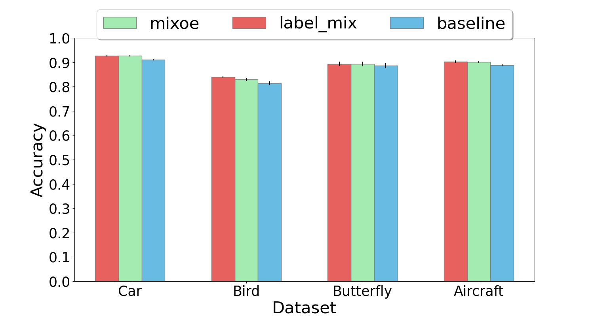
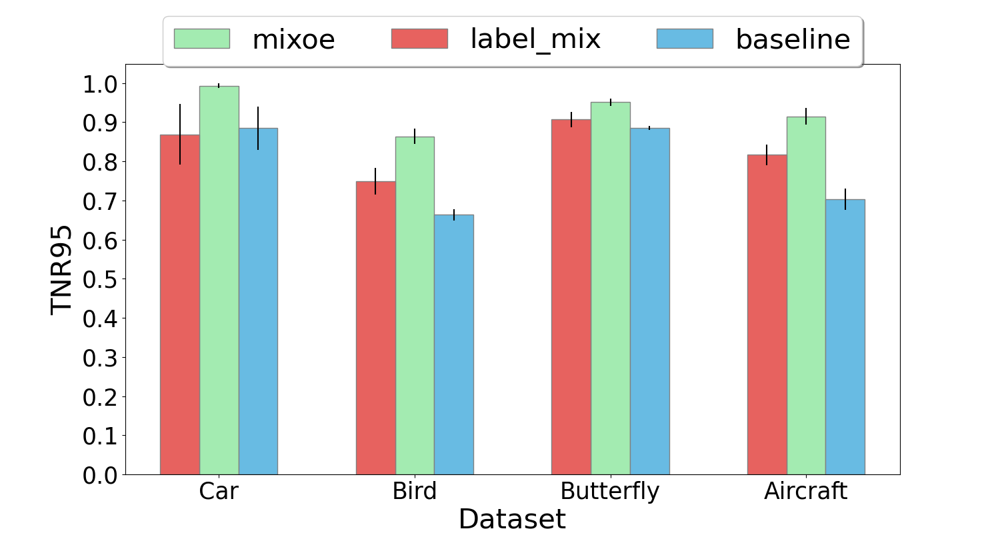
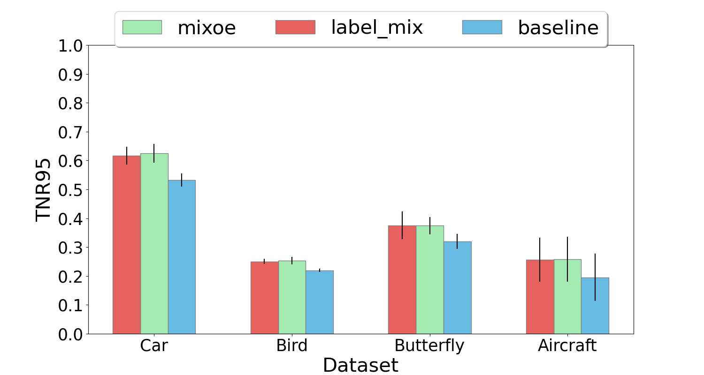
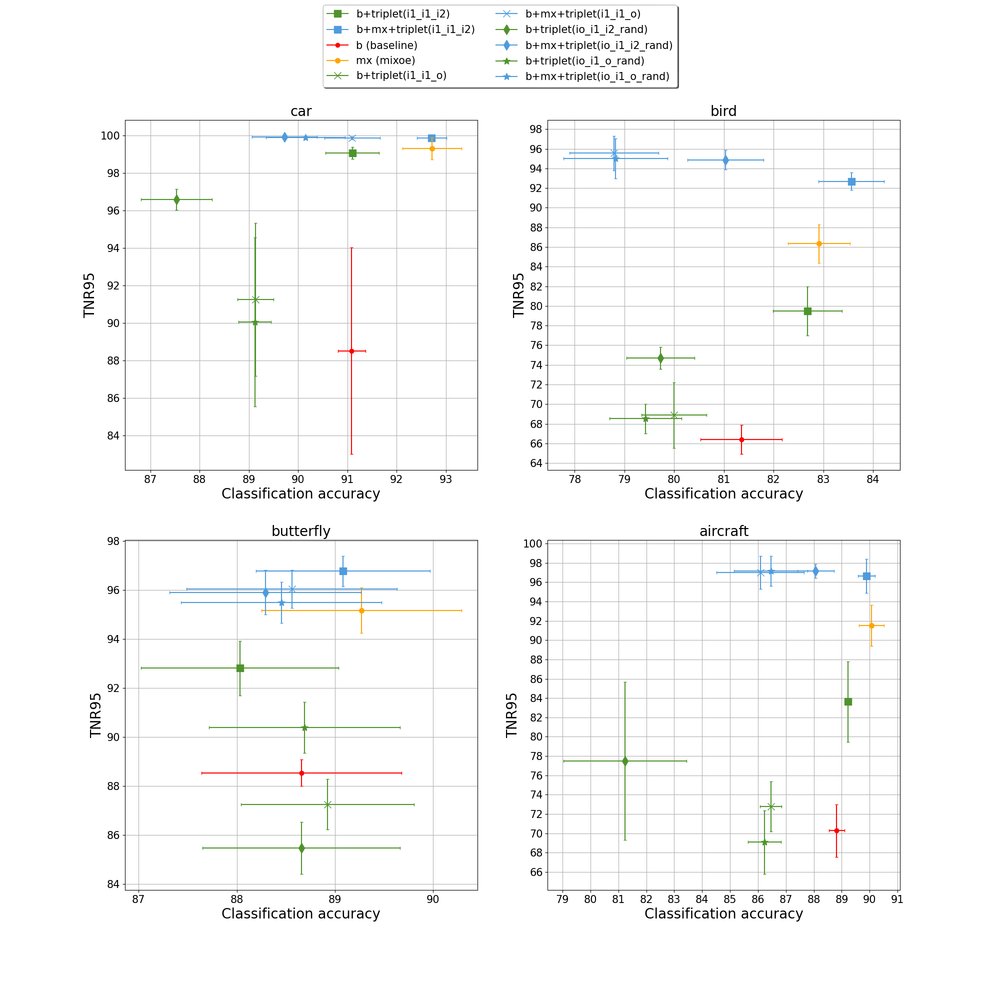
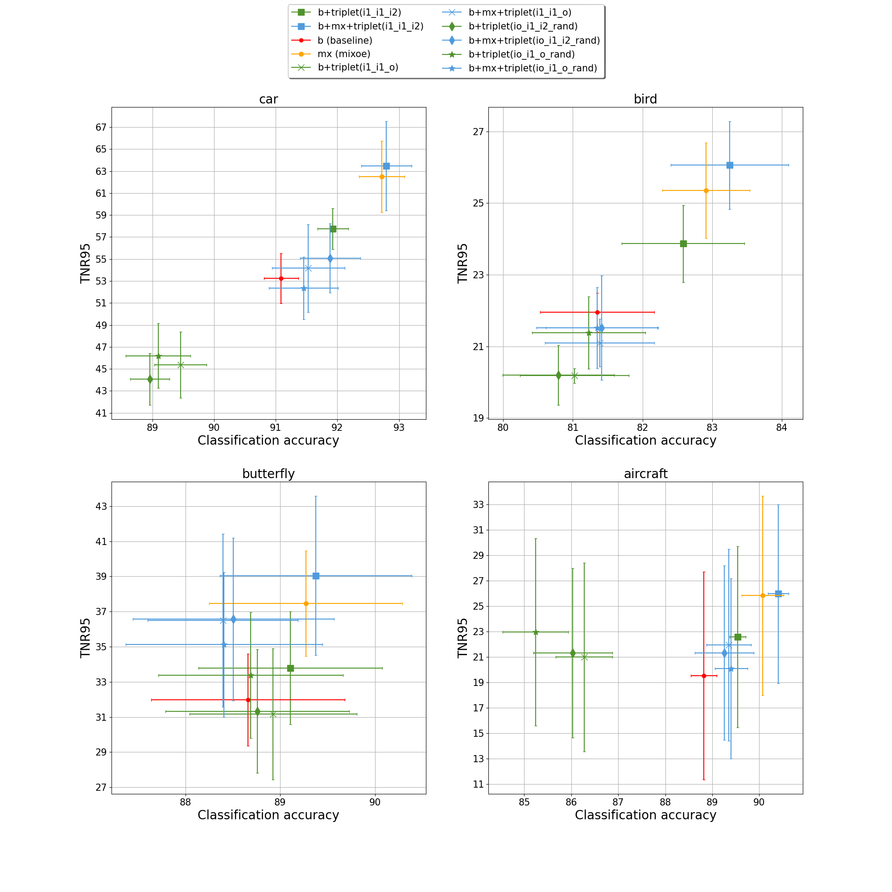

# Mixup and Metric Learning in Out-of-Distribution Detection

Code for thesis: **"Mixup and Metric Learning in Out-of-Distribution Detection"**.

## Table of contents

1. [ Description. ](#desc)
2. [ Installation. ](#installation)
3. [ Dataset setup. ](#data)
4. [ Code structure. ](#codestr)
5. [ Usage. ](#usg)
6. [ Results. ](#results)
7. [ Contributing. ](#contributing)
8. [ License. ](#license)

<a name="desc"></a>
## Description

The thesis focuses on the use of two methods for training more robust models regarding out-of-distribution (OoD) examples. The model and dataset setup is based on MixOE [implementation](https://github.com/zjysteven/MixOE) and the codes for this setup is also taken from MixOE. The OoD testing settings are divided between fine- and coarse-grained examples. The former are derived from the domain of inliers, and the latter are completely different from inliers. There are two kinds of tasks we are trying to solve:

1. Identification of important MixOE ingredients:
    - we use seven different Mixup variants that target different components of Mixup, including:
        - layer, where Mixup is applied (Manifold MixOE, Align MixOE)
        - the role of the label derived from uniform probability distribution (Mixup with labels)
        - loss term (MixOE  with and without OE loss)
        - the confidence of outliers used (MixOE with five lowest confidence outliers)
        - the distance between the outliers and inliers that are being mixed (MixOE with KNN)
        - the role of outliers in the training (Mixup with labels, original input Mixup without outliers, Mixup with a noise image)
    - investigation of the impact of the size of auxiliary dataset 

2. Metric learning in the form of triplet loss
    - different types of triplets are used:
        - I1; I1; I2
        - I1; I1; O
        - I1,O; I1; I2
        - I1,O; I1; O,

    where:
    - I1 is an inlier from class 1.
    - I2 is an inlier from class 2.
    - O is an outlier.
    - I1,O is a mixed pair using Mixup

We also use combination of metric learning approach and MixOE.

<a name="installation"></a>
## Installation

```bash
git clone https://github.com/Oleksandra2020/metric_mix_oe

pip install -r requirements.txt
```

<a name="data"></a>
## Dataset setup

Follow the setup as mentioned in MixOE [implementation](https://github.com/zjysteven/MixOE/blob/main/data/README.md). Five datasets in total are used: Car, Bird, Butterfly, Aircraft and WebVision 1.0.

<a name="codestr"></a>
## Code structure

1. Scripts

    Due to different collection of results for different types of experiments, there are three Python scripts for script generation ;) :
     - Code for the seven Mixup variants along with MixOE uses [wandb](https://wandb.ai/site) to save results. For these, [generate_scripts_mixoe.py](script_generators/generate_scripts_mixoe.py) is used.
     - Code for varying the number of outliers and their classes in the auxiliary outlier dataset uses CSV files to store the results, thus [generate_scripts_outl.py](script_generators/generate_scripts_outl.py) is used.
     - Code for different types of triplets uses CSV files to store the results, thus [generate_scripts_triplet.py](script_generators/generate_scripts_triplet.py) is used.

2. Mixup variants:

    - [train_align.py](train/train_align.py) - Align MixOE
    - [train_knn.py](train/train_knn.py) - MixOE with KNN
    - [train_label.py](train/train_label.py) - Mixup with labels
    - [train_mixoe_inliers.py](train/train_mixoe_inliers.py) - Mixup
    - [train_min_conf.py](train/train_min_conf.py) - MixOE with five min confidence outliers
    - [train_mixoe_manifold.py](train/train_mixoe_manifold.py) - Manifold MixOE
    - [train_noise.py](train/train_noise.py) - Mixup with a noise image

3. Auxiliary outlier dataset perturbations

    [train_mixoe_outl.py](train/train_mixoe_outl.py) takes in ```outlier_num``` and ```outlier_classes``` parameters for sampling different number of outliers and comprising the auxiliary outlier dataset of ranging diversity.

4. Triplet combinations

    We present five different triplet combinations:
    - (I1; I1; I2) - [train_i1_i1_i2.py](train/train_triplet_i1_i1_i2.py)
    - (I1; I1; O) - [train_i1_i1_o.py](train/train_triplet_i1_i1_o.py)
    - (I1,O; I1; I2) - [train_io_i1_i2_rand.py](train/train_triplet_io_i1_i2_rand.py)
    - (I1,O; I1; O) - [train_io_i1_o_rand.py](train/train_triplet_io_i1_o_rand.py)

5. Plotting helpers

- [create_bar_plot.py](plot_funcs/create_bar_plot.py) create bar plots with MixOE, baseline and Mixup with labels.
- [merge_csv_files_outl.py](plot_funcs/merge_csv_files_outl.py) creates plots with the results for the varying of the number of outliers and outlier classes.
- [merge_csv_files_metric.py](plot_funcs/merge_csv_files_metric.py) creates plots with the results for the triplet combinations described above.


<a name="usg"></a>
## Usage

1. Script generation

    ```
    python generate_scripts_mixoe.py
    ```

2. Experiments

    To start running an experiment:

    ```bash
    cd ./scripts/align/aircraft

    bash train_0.sh
    ```

Do not forget to change ```data_dir``` parameter while running your code as well as where to save your results.

<a name="results"></a>
## Results

We find that:
- Mixup with labels is as efficient for fine-grained setup as the complete MixOE.
- the large size of the auxiliary outlier dataset is important only in coarse-grained setup.
- (I1; I1; I2) triplet in combination with MixOE gives the most improvement over the other triplets for coarse-grained setup over the previous best result, MixOE.
- metric learning approach does not improve fine-grained settings, neither by itself or with MixOE combination.

### Mixup with labels accuracy:


### Mixup with labels coarse-grained TNR@95TRP:


### Mixup with labels fine-grained TNR@95TRP:



### Coarse-grained results for all triplets

Green colour indicates triplet loss with standard cross-entropy, and blue is with MixOE.



### Fine-grained results for all triplets

Green colour indicates triplet loss with standard cross-entropy, and blue is with MixOE.



### Coarse-grained results for (I,O; I1; I2)
=

<a name="contributing"></a>
## Contributing

Pull requests are welcome. For major changes, please open an issue first
to discuss what you would like to change.

<a name="license"></a>
## License

[MIT](https://choosealicense.com/licenses/mit/)